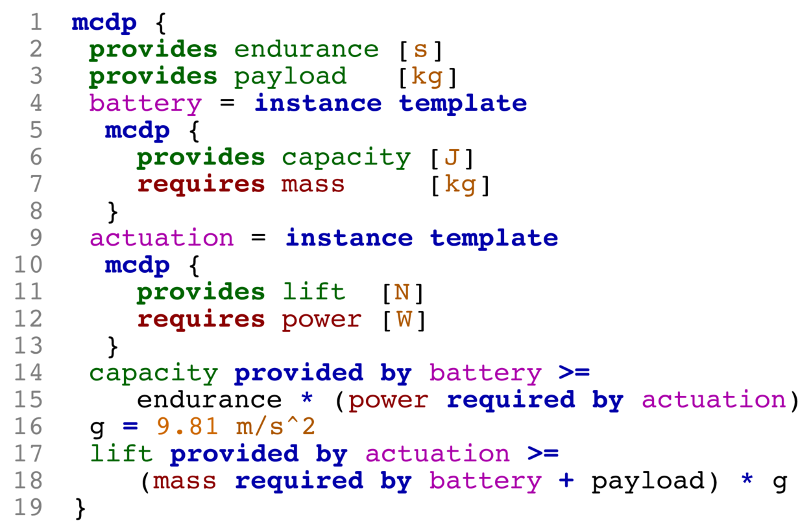
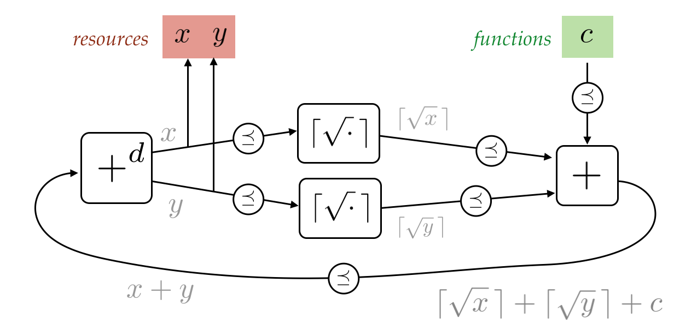

**PyMCDP** is a Python interpreter and solver for Monotone Co-Design Problems.
It is currently in beta-testing. Please email censi@mit.edu if you wish to help.

Please see <http://mcdp.mit.edu> for an introduction (or some [examples][examples]).

[examples]: http://mcdp.mit.edu/examples.html

*Below, an example of a graphical representation of an MCDP (left)
along with the MCDPL snippet that describes it (right)*

<table>
 <tr>
 <td></td>
 <td>
 </td>
 </tr>
</table>

## Installation

The code has been tested on Ubuntu 14.04, Ubuntu 16.04, and OS X using Enthought Python distribution.

### Prerequisites

On Ubuntu:

    $ sudo apt-get install python-numpy python-matplotlib python-yaml python-pip python-dev python-setproctitle python-psutil graphviz wkhtmltopdf git 

### Option 1: Install using pip

Run this command:

    $ sudo pip install -U PyMCDP conftools quickapp decentlogs systemcmd

Note that if you omit the ``sudo``, modern Ubuntu 16 will install 
correctly in the directory ``~/.local/``. In this case,
make sure you have ``~/.local/bin/`` in your ``PATH``.

### Option 2: Installation from source (preferred)

Clone the repo using: 

    $ git clone https://github.com/AndreaCensi/mcdp.git

Jump into the directory:
    
	$ cd mcdp

Then install the main module:
    
    $ sudo python setup.py develop 

Omit the sudo if you have already set up a virtual environment.

## Getting started

#### Running the web interface

Run the command:

    $ mcdp-web

Then point your browser to the address <http://127.0.0.1:8080/>.

#### Solving Monotone Co-Design Problems

The program ``mcdp-solve`` is a solver.

    $ mcdp-solve -d <library> <model_name>  <functionality>
    
For example, to solve the MCDP specified in the file ``battery.mcdp`` in
the library ``mcdp_data/libraries/examples/example-battery.mcdplib``, use:

    $ mcdp-solve -d mcdp_data/libraries/examples/example-battery.mcdplib battery "<1 hour, 0.1 kg, 1 W>"

The expected output is:

    ...
    Iteration result: ConvergedToFinite
    Fixed-point iteration converged to: {x ∣ x ≥ (0.03941 kg, 0.13941 kg) }
    Minimal resources needed: mass = {x ∣ x ≥ 0.03941 kg }

This is the case of unreasonable demands (1 kg of extra payload):

    $ mcdp-solve -d mcdp_data/libraries/examples/example-battery.mcdplib battery "<1 hour, 1.0 kg, 1 W>"

This is the expected output:

    Iteration result: ConvergedToTop
    Fixed-point iteration converged to: {x ∣ x ≥ (⊤, ⊤) }
    Minimal resources needed: mass = {x ∣ x ≥ ⊤ }

#### Visualization of Co-Design Problems

The programs ``mcdp-plot`` will parse and plot the MCDP in a variety of representations.

    $ mcdp-plot  -d <library> <model name>

For example, the command

    $ mcdp-plot  -d mcdp_data/libraries/examples/example-battery.mcdplib battery
    
will produce these graphs:

<table>
    <tr>
        <td>Syntax highlighting</td>
        <td>
        </td>
    </tr>
    <tr><td>Verbose graph</td><td></td></tr>
    <tr><td>Cleaned-up graph</td><td ></td></tr>
    <tr><td>Tree representation</td><td></td></tr>
    </tr>
</table>

<h2>Visualization of the solution</h2>

To solve an MCDP, one constructs a chain of antichains in the product poset of resources. 

The animations below show the sequence of antichains being
constructed to solve two variations of the same problem.

(Whether the problem statement describes an MCDP is 
absolutely not obvious using the formula representation;  it becomes obvious when writing the problem as a graph
of monotone problems.)

<table>
    <tr><td colspan="2">
        
    </td></tr>
    <tr>
     <td></td>
     <td>
     </td>
     </tr>
     <tr>
     <td></td>
     <td></td>
     </tr>
     <tr>
     <td colspan="2"></td>
     </tr>
</table>

<h2>More information</h2>

For more information, please see <http://mcdp.mit.edu>.

