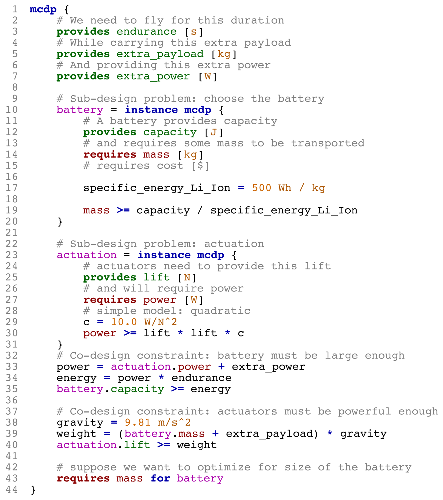
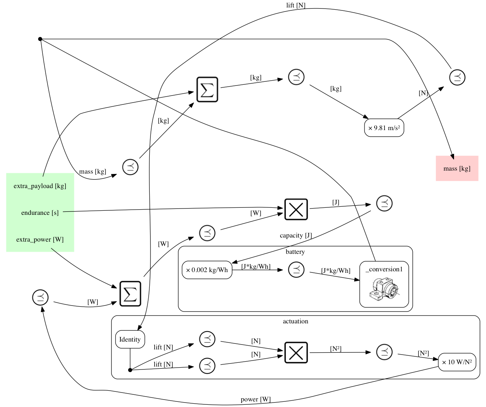
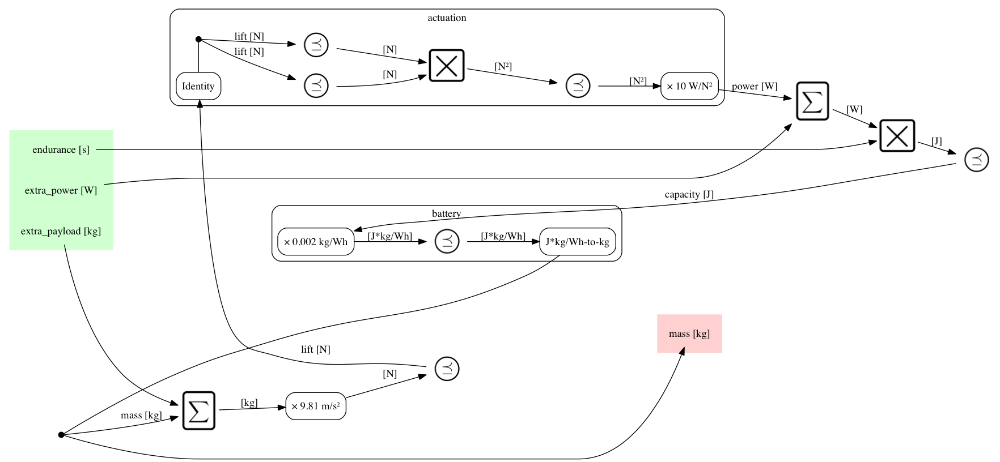
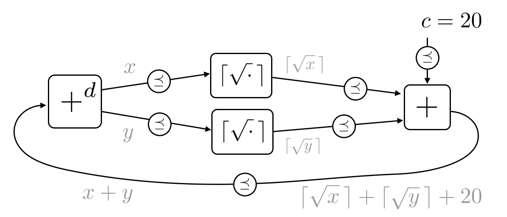
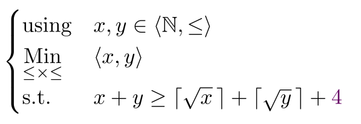

**PyMCDP** is a Python interpreter and solver for Monotone Co-Design Problems.
It is currently in beta-testing. Please email censi@mit.edu if you wish to help.

Please see <http://mcdp.mit.edu> for an introduction (or some [examples][examples]).

[examples]: http://mcdp.mit.edu/examples.html

*Below, an example of a graphical representation of an MCDP (left)
along with the MCDPL snippet that describes it (right)*

<table>
 <tr>
 <td></td>
 <td>
 </td>
 </tr>
</table>

## Installation

### Prerequisites

On Ubuntu:

    $ sudo apt-get install python-numpy python-matplotlib python-yaml python-pip
    $ sudo apt-get install graphviz wkhtmltopdf

### Installation with pip

Run this:

	$ pip install -U PyMCDP 

### Installation from source

Install Git:

    $ sudo apt-get install git

Clone the repo using: 

    $ git clone https://github.com/AndreaCensi/mcdp.git

Jump into the directory:
    
	$ cd mcdp

Install the dependencies:

    $ sudo pip install -r requirements.txt

Then install the main module:
    
    $ sudo python setup.py develop 

Omit the sudo if you have a virtual env installed.

## Getting started

<!-- 	 -->

#### Solving Monotone Co-Design Problems

The program ``mcdp-solve`` is a solver.

    $ mcdp-solve <filename>.mcdp <f1> <f2> ...
    
For example, to solve the problem specified in ``examples/example-battery/battery.mcdp``, use:

    $ mcdp-solve examples/example-battery/battery.mcdp "<1 hour, 0.1 kg, 1 W>"

The expected output is:

    ...
    Iteration result: ConvergedToFinite
    Fixed-point iteration converged to: {x ∣ x ≥ (0.03941 kg, 0.13941 kg) }
    Minimal resources needed: mass = {x ∣ x ≥ 0.03941 kg }

This is the case of unreasonable demands (1 kg of extra payload):

    $ mcdp-solve examples/example-battery/battery.mcdp "<1 hour, 1.0 kg, 1 W>"

This is the expected output:

    Iteration result: ConvergedToTop
    Fixed-point iteration converged to: {x ∣ x ≥ (⊤, ⊤) }
    Minimal resources needed: mass = {x ∣ x ≥ ⊤ }

#### Visualization of Co-Design Problems

The programs ``mcdp-plot`` will parse and plot the MCDP in a variety of representations.

    $ mcdp-plot <filename>.mcdp

For example, the command

    $ mcdp-plot examples/example-battery/battery.mcdp 
    
will produce these graphs:

<table>
    <tr>
        <td>Syntax highlighting</td>
        <td>
        </td>
    </tr>
    <tr><td>Verbose graph</td><td></td></tr>
    <tr><td>Cleaned-up graph</td><td ></td></tr>
    <tr><td>Tree representation</td><td></td></tr>
    </tr>
</table>

<h2>Visualization of the solution</h2>

To solve an MCDP, one constructs a chain of antichains in the product poset of resources. 

The animations below show the sequence of antichains being
constructed to solve two variations of the same problem.

(Whether the problem statement describes an MCDP is 
absolutely not obvious using the formula representation;  it becomes obvious when writing the problem as a graph
of monotone problems.)

<table>
    <tr><td colspan="2">
        
    </td></tr>
    <tr>
     <td></td>
     <td>
     </td>
     </tr>
     <tr>
     <td></td>
     <td></td>
     </tr>
     <tr>
     <td colspan="2"></td>
     </tr>
</table>

<h2>More information</h2>

For more information, please see <http://mcdp.mit.edu>.

