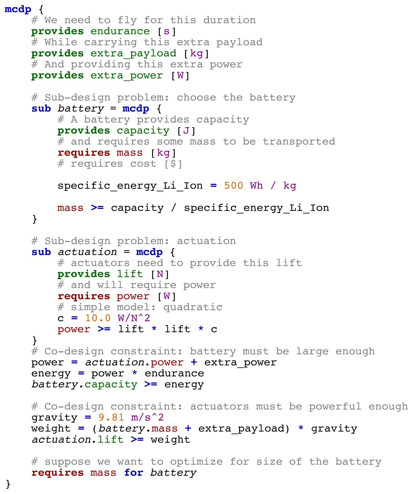
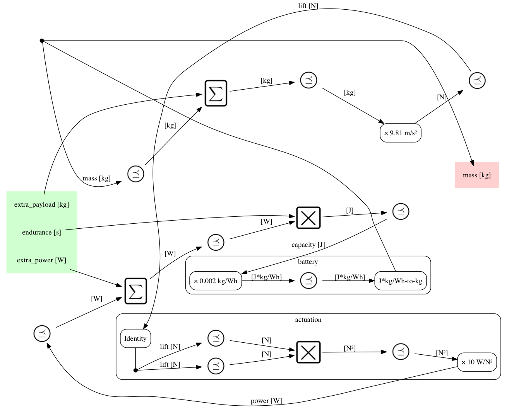
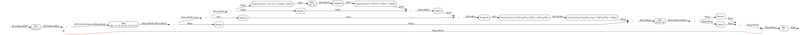

**PyMCDP** is a Python interpreter and solver for Monotone Co-Design Problems.
It is currently in beta-testing. Please email censi@mit.edu if you wish to help.

Please see <http://mcdp.mit.edu> for the theory behind it.

*Below, an example of a graphical representation of an MCDP (left)
along with the MCDPL snippet that describes it (right)*

## Installation with pip

Run this:

	$ pip install -U PyMCDP 

## Installation from source

Clone the repo:

	$ git clone git@github.com:AndreaCensi/mcdp.git
	$ cd mcdp

Install the dependencies:

    $ pip install -r requirements.txt

Then install the main module:
    
    $ python setup.py develop 

## Getting started

<!-- 	 -->

#### Solving Co-Design Problems
    
The program ``mcdp-solve`` is a solver.

    $ mcdp-solve <filename>.mcdp <f1> <f2> ...
    
For example, to solve one of the examples specified in ``examples/example-battery/out/battery.mcdp'', use:

    $ mcdp-solve examples/example-battery/battery.mcdp "1 hour" "0.1 kg" "1 W"

The expected output is:

    ...
    Iteration result: ConvergedToFinite
    Fixed-point iteration converged to: {x ∣ x ≥ (0.03941 kg, 0.13941 kg) }
    Minimal resources needed: mass = {x ∣ x ≥ 0.03941 kg }

This is the case of unreasonable demands (1 kg of extra payload):

    $ mcdp-solve examples/example-battery/battery.mcdp "1 hour" "1.0 kg" "1 W"

This is the expected output:

    Iteration result: ConvergedToTop
    Fixed-point iteration converged to: {x ∣ x ≥ (⊤, ⊤) }
    Minimal resources needed: mass = {x ∣ x ≥ ⊤ }

#### Drawing Co-Design Problems diagrams

The programs ``mcdp-plot`` will parse and plot the MCDP in a variety of representations.

    $ mcdp-plot <filename>.mcdp

For example, the command

    $ mcdp-plot examples/example-battery/battery.mcdp 
    
will produce these graphs:

<table>
<tr>
    <td>Syntax highlighting</td>
    <td>
    </td>
</tr>
<tr><td>Verbose graph</td><td></td></tr>
<tr><td>Cleaned-up graph</td><td ></td></tr>
<tr><td>Tree representation</td><td></td></tr>
</tr></table>
 

