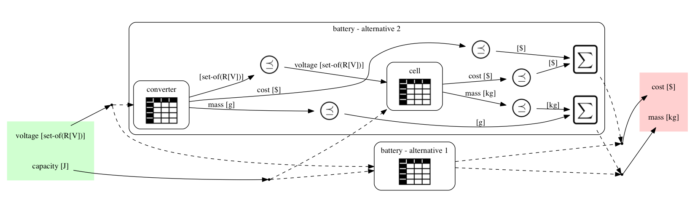

	

## Complex co-product

This is a nontrivial example where we can choose either a simple 
cell, or a cell with a voltage converter.

<pre><code> 1mcdp {
 2    
 3    simple_cell = catalogue {
 4        provides voltage  [℘(V)]
 5        provides capacity [J]
 6
 7        requires cost [$]
 8        requires mass [kg]
 9
10        # These two have some functions, but
11        # non-dominating resources
12        model1 | {1.5 V} | 1 MJ |  5 $ | 0.20 kg 
13        model2 | {1.5 V} | 1 MJ | 15 $ | 0.10 kg 
14        # This model gives 5V and needs an adapter
15        model3 | {5.0 V} | 1 MJ |  5 $ | 0.30 kg
16    }
17    
18    converters = catalogue {
19        provides voltage    [set-of(V)]
20        requires v_in       [set-of(V)]
21        requires cost       [$]
22        requires mass       [g]
23
24        step_up1 | {5 V}        | {1.5 V} |  5 $ | 20 g  
25        step_up2 |       {12 V} | {1.5 V} | 10 $ | 20 g  
26        step_up2 | {5 V,  12 V} | {1.5 V} | 10 $ | 20 g  
27    }
28
29    cell_plus_converter = mcdp { 
30
31        converter = instance converters
32        cell = instance simple_cell
33
34        provides voltage  using converter
35        provides capacity using cell
36
37        (v_in required by converter) ⊆ (voltage provided by cell)
38
39        requires cost ≥ (cost required by cell + cost required by converter)
40        requires mass ≥ (mass required by cell + mass required by converter)
41    }
42
43    battery = instance simple_cell ^ cell_plus_converter
44    requires cost, mass for battery
45    provides voltage, capacity using battery
46}
</code></pre>

  

