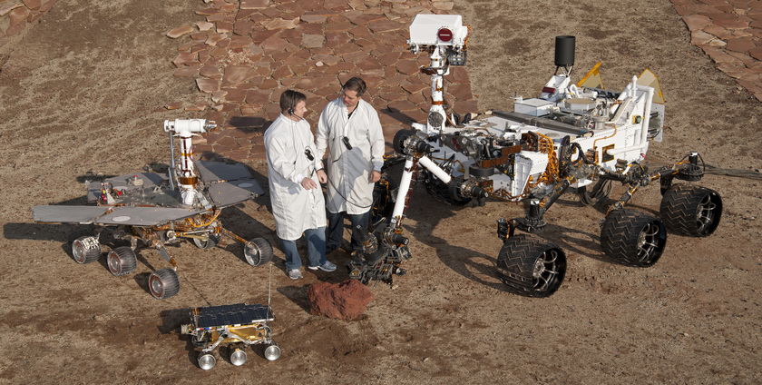

Space Rovers Energetics
=======================

A thermocouple is a device that converts heat into electrical power.

<table><tr><td>
    <pre class="mcdp" id="Thermocouple" label='Thermocouple.mcdp'/>
</td><td>
    <pre class="ndp_graph_templatized_labeled"
        style='height: 10em'
        >`Thermocouple</pre>
</pre></td></tr>

One way to get the heat is to procure a bit of Plutonium.

<table><tr><td>
    <pre class="mcdp" id="PlutoniumPellet" label='PlutoniumPellet.mcdp'/>
</td><td>
    <pre class="ndp_graph_templatized_labeled"
        style='sheight: 10em'
        >`PlutoniumPellet</pre>
</pre></td></tr>

We can connect the two, by specifying that the heat required by the 
thermocouple is provided by the pellet:

<pre class="ndp_graph_enclosed" enclosed="false">
mcdp {
    plutonium_pellet = new PlutoniumPellet

    thermocouple = instance template `Thermocouple
    heat required by thermocouple <= heat provided by plutonium_pellet
}
</pre>

The masses are summed together:

<pre class="mcdp" id='rtig'/>

<pre class="ndp_graph_enclosed">`rtig</pre>
