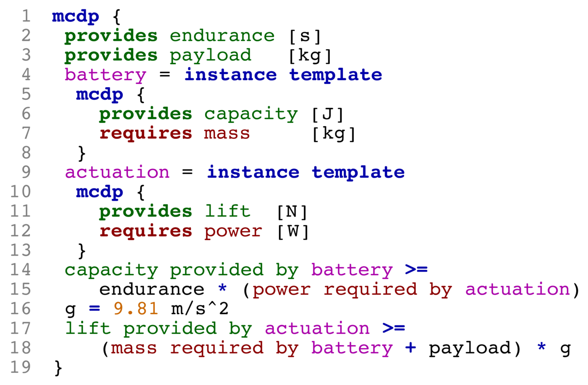

**Monotone Co-Design Problems (MCDPs)** are a class of extremely expressive optimization problems. They can express: non-convex constraints, non-differentiable, discontinuous and non-scalarizable objective functions, and work with non-continuous design spaces.

<strong>MCDPL</strong> is an extremely expressive language to describe MCDPs.
**[PyMCDP][PyMCDP]** is a Python interpreter and "compiler" for MCDPL, as well as a solver.

For more information, please see:

* [the papers](/papers/) 
* a [live demo site][demo] 
* the [software manual (PDF)][manual].

[manual]: https://andreacensi.github.io/mcdp-manual/mcdp-manual.pdf

[demo]: http://demo.co-design.science/ 

*Below, an example of a graphical representation of an MCDP (left)
along with the MCDPL snippet that describes it (right).*

<table>
 <tr>
 <td></td>
 <td>
 </td>
 </tr>
</table>

  <!-- <h1 class="page-heading">News</h1> -->

  <!-- <h2 style='margin-top: 10em'> News </h2> -->
  <ul class="post-list">
    
      <li>
        {{ post.date | date: "%Y-%m-%d" }}

        {{ post.title }}

        <!-- <a href="{{ post.url | prepend: site.baseurl }}">{{ post.title }}</a> -->
  
        {{ post.content }}
      </li>
    
  </ul>
<!-- 
  
subscribe <a href="{{ "/feed.xml" | prepend: site.baseurl }}">via RSS</a>
 -->

[PyMCDP]: http://github.com/AndreaCensi/mcdp

