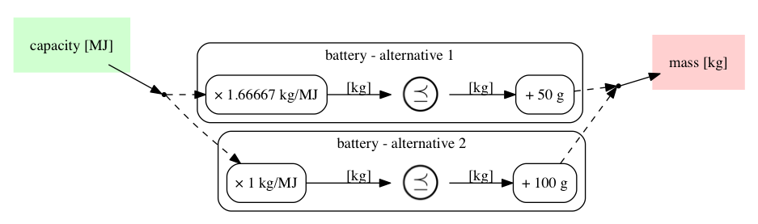

	

## Coproduct of design problems

This is an example of a simple *[coproduct][coproduct] of design problems*. The choice between
two types of battery switches according to the energy required.

[coproduct]: https://en.wikipedia.org/wiki/Coproduct

<pre><code> 1mcdp {
 2    battery1 = mcdp {
 3        provides capacity [MJ]
 4        requires mass [kg]
 5
 6        m0 = 50 g
 7        specific_energy = 0.6 MJ / kg 
 8
 9        mass &gt;= capacity / specific_energy + m0
10    }
11    
12    battery2 = mcdp {
13        provides capacity [MJ]
14        requires mass [kg]
15
16        m0 = 100 g 
17        specific_energy = 1.0 MJ / kg
18
19        mass &gt;= capacity / specific_energy + m0
20    }
21
22    battery = instance (battery1 ^ battery2)
23
24    requires mass for battery
25    provides capacity using battery
26}
</code></pre>

  

